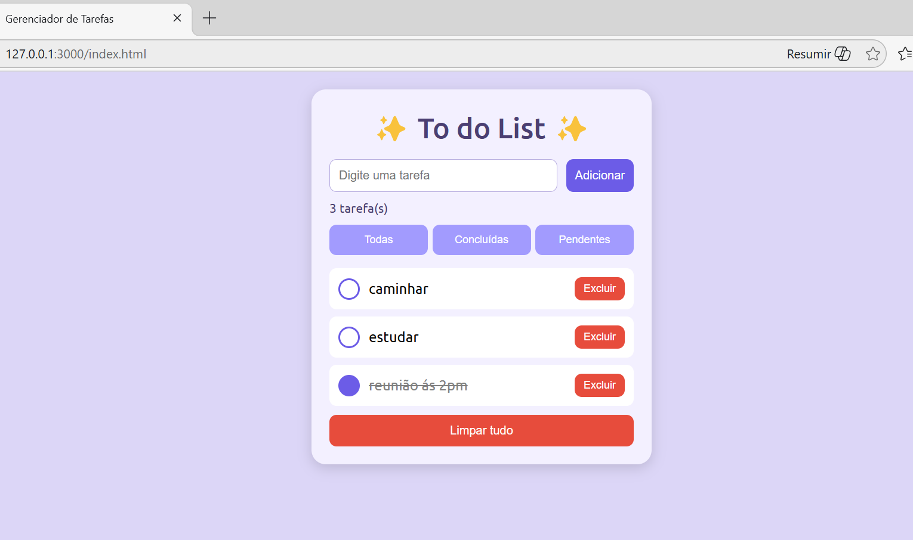

#  ✨ To do List ✨

Aplicação de gerenciamento de tarefas desenvolvida com JavaScript puro.
Permite adicionar, concluir, filtrar e remover tarefas, com salvamento automático no navegador.

---

## 🔗 Para acessar o projeto

👉 https://nanathdev.github.io/To-do-list-javascript/

---

##  Funcionalidades

* Adicionar tarefas (botão e tecla ENTER)
* Marcar como concluída
* Excluir tarefas
* Filtrar tarefas (todas, concluídas, pendentes)
* Contador de tarefas
* Limpar todas as tarefas
* Salvamento com LocalStorage

---

## Tecnologias

* HTML5
* CSS3
* JavaScript

---

## 📱 Interface

Layout simples, limpo e responsivo, inspirado em aplicativos mobile.

